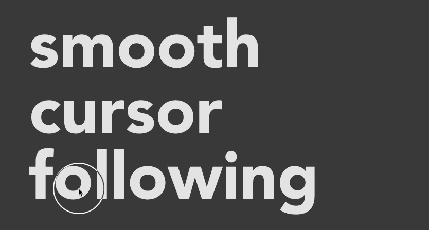
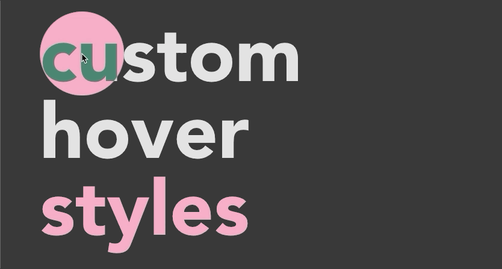

# cursor-dot
> A vanilla JavaScript library which creates customizable, interactive cursor effects when hovering over certain elements.


[](https://saythanks.io/to/gaoryrt)


English | [简体中文](./README.zh-cn.md)

## Installation 🏗️

### A: yarn or npm
```bash
$ yarn add cursor-dot
```
or
```bash
npm i cursor-dot
```
then you can:
```js
import curDot from 'cursor-dot'
```
in your js files.

### B: use `window.curDot.min.js` file
Download `dist/window.curDot.min.js` file into your project, and in your html file:
```html
<script src="path/to/your/window.curDot.min.js"></script>
```
then you can use `window.curDot`


## Usage 🍹


```js
const cursor = curDot()
// or, set as you want
// cursor({
//   zIndex: 2,
//   diameter: 80,
//   borderWidth: 1,
//   borderColor: 'transparent',
//   easing: 4,
//   background: '#ddd'
// })
```
---

```js
cursor.over('span.selector', {
  borderColor: 'rgba(255,255,255,.38)',
  broderWidth: 2
})

cursor.over($('El'), {
  scale: .5,
  background: '#fff'
})
```

## Destroy & re-init 🔄

```js
let cursor = curDot({ easing: 4 })

// destroy when done (removes listeners, stops animation, removes DOM)
cursor.destroy()

// re-init with new options
cursor = curDot({ easing: 8, diameter: 100 })
```

## [Give it a try](https://codesandbox.io/s/focused-ellis-g9mpm)
