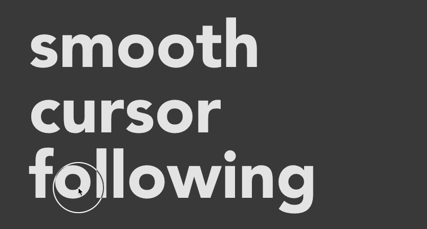

# cursor-dot
> 平滑的鼠标跟随


[English](./README.md) | 简体中文

## 安装 🏗️

```bash
$ yarn add cursor-dot
```

## 使用 🍹

```js
import curDot from 'cursor-dot'
```
---

```js
const cursor = curDot()
// 也可以自定义：
// cursor({
//   diameter: 80,
//   borderWidth: 1,
//   borderColor: 'transparent',
//   easing: 4,
//   background: '#fff'
// })
```
---

```js
cursor.over('span.selector', {
  borderColor: 'rgba(255,255,255,.38)',
  broderWidth: 2
})

cursor.over($('El'), {
  scale: .5,
  background: '#fff'
})
```

## [在线 Demo](https://codesandbox.io/s/focused-ellis-g9mpm)
